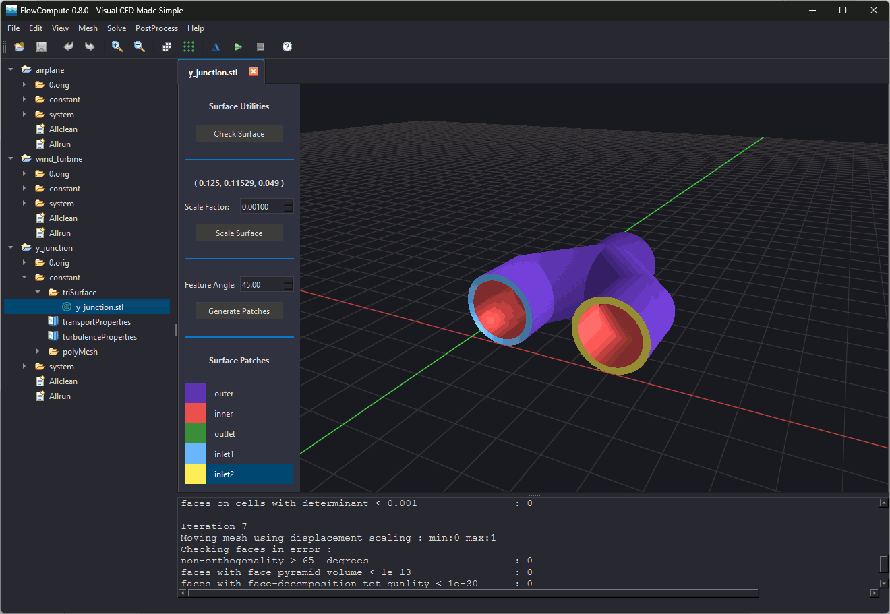

# FlowCompute: A Cross-Platform OpenFOAM Client

FlowCompute is an open-source graphical client for OpenFOAM. Available for Windows and Linux, it lets you create cases, generate meshes, configure simulations, and launch OpenFOAM tools without relying on the command line. FlowCompute can access OpenFOAM running natively on Linux, inside the Windows Subsystem for Linux (WSL), or on a remote Linux server.

Released under the GNU Lesser General Public License (LGPL), FlowCompute is free to use, modify, and distribute. The complete source code is available on [Github](https://github.com/FlowComputeClient/flowcompute).

## Features and Capabilities

The client streamlines case management by generating dictionary files based on user input. Powerful wizards guide users through creating case folders, customizing the meshing process, and configuring the simulation. When all the dictionary files have been created, OpenFOAM utilities can be launched using buttons.

Important features include:
*   **High-performance rendering** - Utilizing a custom Vulkan rendering pipeline, the interface will accurately display STL surfaces, OpenFOAM meshes, and computed results (scalar only).
*   **Configuration wizards** - Easily generate case files, mesh configuration files, and simulation files.
*   **Text editors** - Natively edit and update dictionary files with syntax coloring and error checking.
*   **Utility access** - Instantly launch OpenFOAM utilities using traditional dialogs and buttons.
*   **Data validation** - Automatically ensure that dictionary files are formatted correctly.

---
&copy; 2026 FlowCompute LLC &dash; All rights reserved